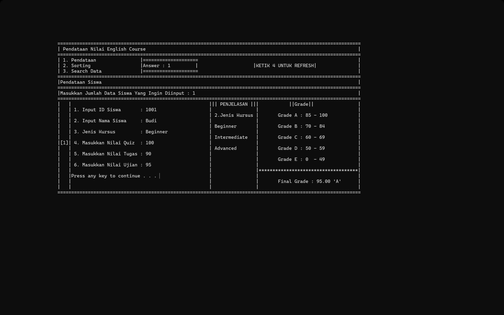
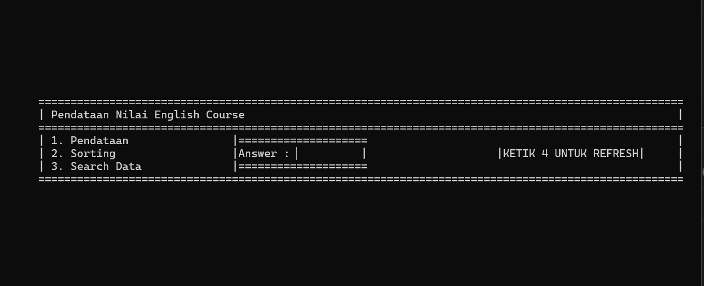

# 🎓 1st Semester Project – Input Score in C

This project is a **Final Project** for the 1st semester, developed in **C language**.  
It is a simple application to input, store, and display student data and their scores, created together with my classmates :D.


## 📸 Preview Screenshots  

Here are some previews of the program in action:  

  
  

---

## 📂 Project Structure
- `Final_Project.c` → Main source code  
- `Final_Project.exe` → Executable file (Windows)  
- `DataSiswa.txt` → Processed student data  
- `DataSiswaRaw.txt` → Raw student data  
- `screenshot/` → Folder containing program previews  

---

## ⚙️ How to Run
Run the following commands step by step in the terminal:

```bash
# 1. Clone the repository
git clone https://github.com/WizdoL/1st-Semester-Project-Lab---Input-Score-in-C.git

# 2. Navigate into the project folder
cd 1st-Semester-Project-Lab---Input-Score-in-C

# 3. Compile the source code
gcc Final_Project.c -o Final_Project.exe

# 4. Run the program
./Final_Project.exe

---


